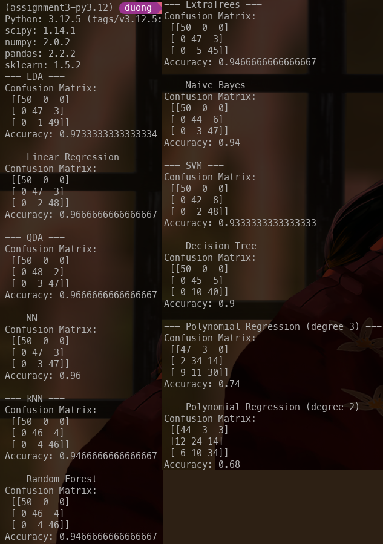
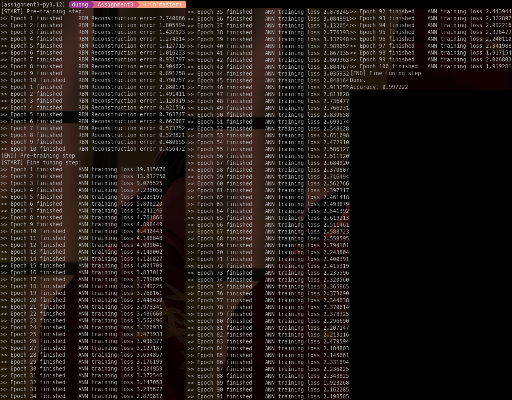

3\. Screen print showing the successful execution of CompareMLModelsV2
-------

4a. Based on accuracy which model is the best one?
-------
LDA performs the best by accuracy, with a ~97% accuracy. 

4b. For each of the 11 other models, explain why you think it does not
perform as well as the best one.
-------
The models from best to worst performance are as follows:
- LDA, Accuracy: 0.9733333333333334
- Linear Regression, Accuracy: 0.9666666666666667
- QDA, Accuracy: 0.9666666666666667
- NN, Accuracy: 0.96
- Random Forest, Accuracy: 0.9466666666666667
- Extra Trees, Accuracy: 0.9466666666666667
- Naive Bayes, Accuracy: 0.94
- SVM, Accuracy: 0.9333333333333333
- Decision Tree, Accuracy: 0.9333333333333333
- Polynomial (3rd Degree), Accuracy: 0.74
- Polynomial (2nd Degree), Accuracy: 0.68

The reasons this may be is because:
> kNN: performs well because it can learn complex decision boundaries not necessarily quadratic or linear.
> 
> LDA: performs well because iris classes are relatively seperated, but may lack nuance since edge boundaries aren't
> linear. so does well but not as well as QDA.
> 
> Naive Bayes: makes assumptions about feature indepence, which may not neccesarily be true
> 
> Linear Regression: does remarkably well, because the iris classes ended up being relatively linear from
> feature to classes. may fail in more complex scenarios, larger sample size, or more classes and features.
> 
> Polynomial Regression (3rd then 2nd): these are the worst for the same reasons, a regression fit is simply
> not the correct choice for this sort of classification task, the degree is simply too low in both cases to
> model the decision boundaries for the iris dataset
>
> \- Verbatim from Assignment 2

All five new models suffer from extra complexity that may help model more complex and larger feature-rich datasets, but perform
relatively poorly in the small iris dataset which is already relatively linearly seperable, as well as has only 4 output classes.
Note that they still perform all above 90% accuracy, but LDA outperforms them.

SVM: Useful for high-dimension spaces (ie. feature-rich datasets), whereas iris dataset lacks that complexity (with only 4 features),
and struggles with the class overlap in the iris dataset.

Decision Tree: If the decision tree incorrectly prioritizes features for its decision trees, may give incorrect weighting and may
not model as accurately as LDA.

Random Forest: See above, as an extension of Decision Tree suffers the same weaknesses. Also since there are only four classes, 
ensemble modelling of the small iris dataset is not particularly useful.

ExtraTrees: The random splits chosen by extra trees may cause underfitting by not correctly modelling the linear seperability
of the iris dataset.

NN: The dataset of 150, may not provide enough training data for the NN to understand the linear seperability of the iris
dataset.

6\. Screen print showing the successful execution of dbn.py
-------

7\.
-------
+ a. No, it simply splits the data into training and testing data sets.
+ b. 80% of the dataset is used for training (`0.2` was specified for parameter `test_size` to `train_test_split`)
+ c. There are 1797 samples total (see `samples` under [documentation for `load_digits`](https://scikit-learn.org/stable/modules/generated/sklearn.datasets.load_digits.html)),
   With 0.2*1797=359.4, so <ins>359 samples were used for testing</ins>
+ d. 1797-359 = <ins>1438 samples used for training</ins>
+ e. There are 64 features in the test set (see `dimensionality` under [documentation for `load_digits`](https://scikit-learn.org/stable/modules/generated/sklearn.datasets.load_digits.html))
+ f. There are 64 features in the training set
+ g. There are 10 classes, digits 0-9
+ h. `[0, 1, 2, 3, 4, 5, 6, 7, 8, 9]`