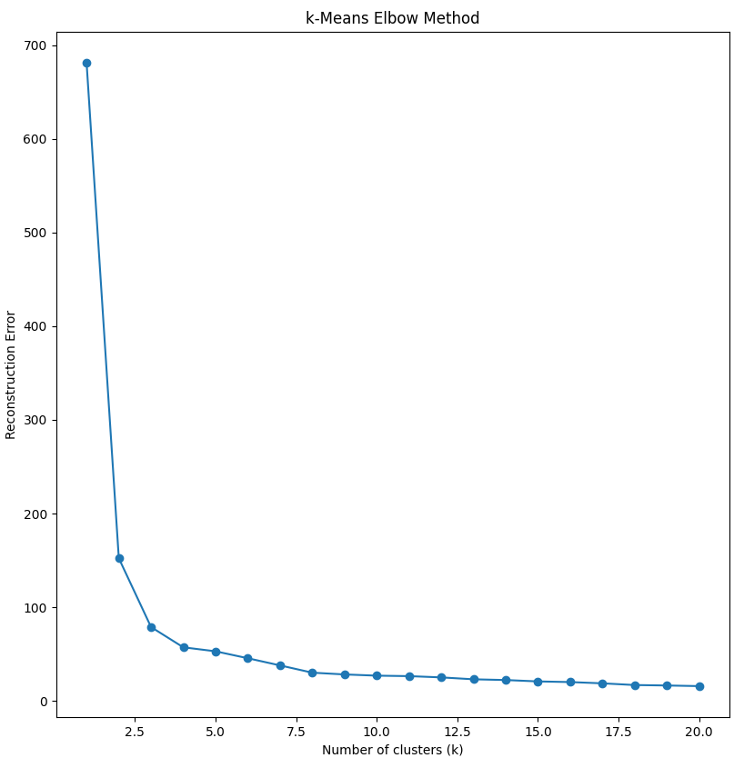
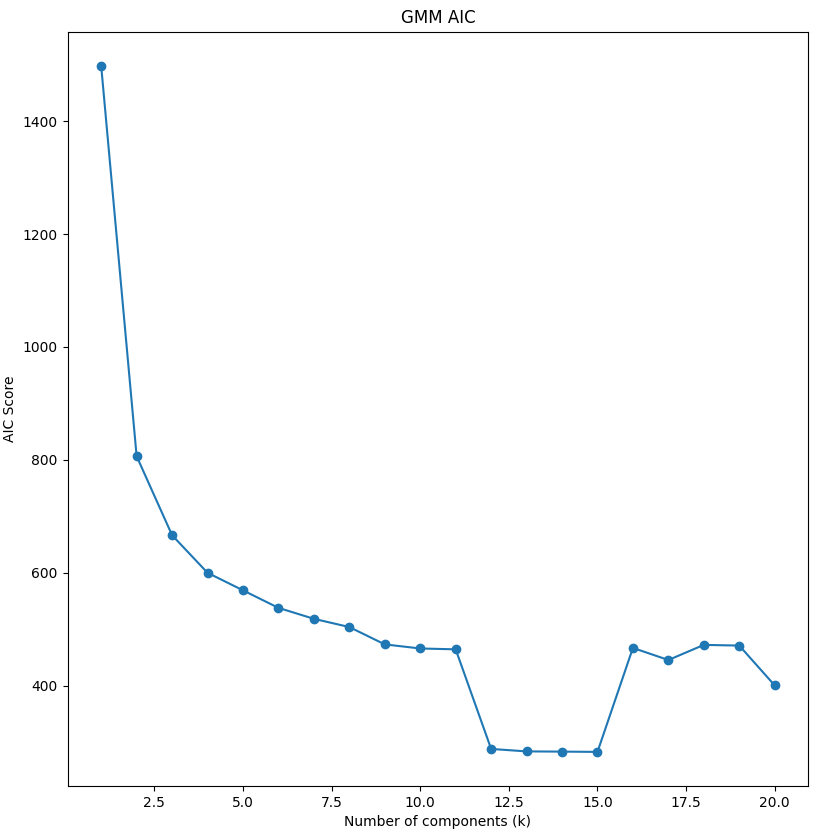
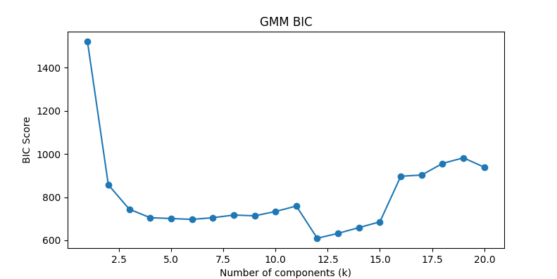
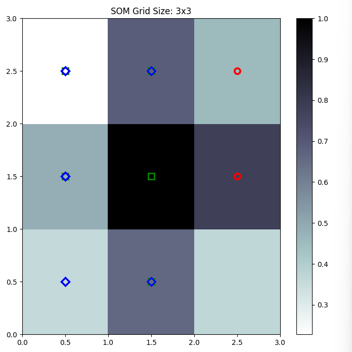
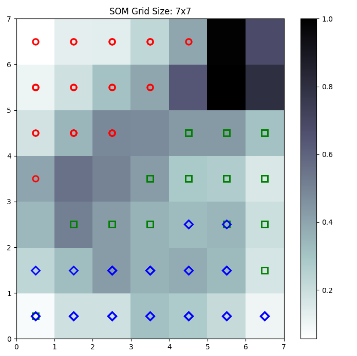
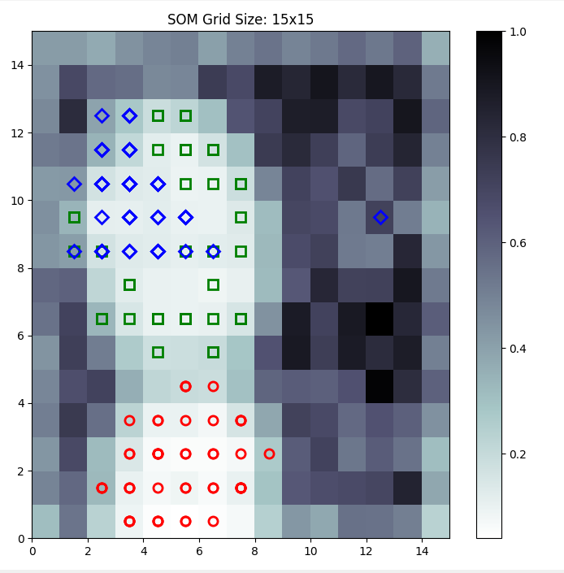
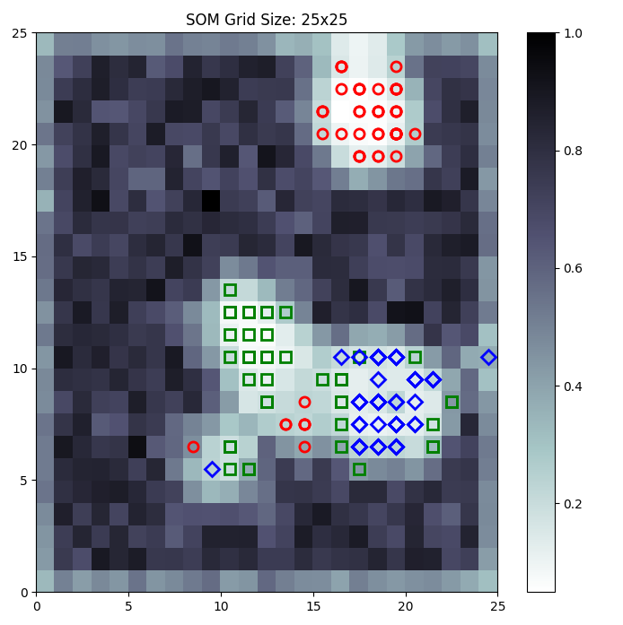
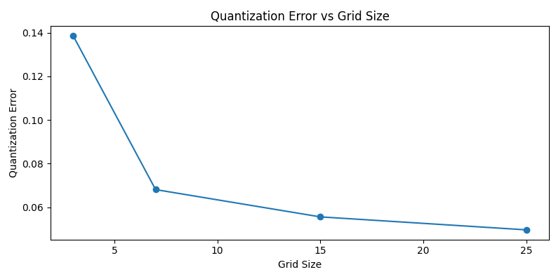

# Report
## Screencapture / Output

```pwsh
duong  Assignment6  ➜ ( master)  ♥ 22:57  uv run .\main.py
Python: 3.12.5 (tags/v3.12.5:ff3bc82, Aug  6 2024, 20:45:27) [MSC v.1940 64 bit (AMD64)]
scipy: 1.14.1
numpy: 2.1.3
pandas: 2.2.3
sklearn: 1.5.2
minisom: 2.3.3
matplotlib: 3.9.2

Part 1:
Enter the elbow_k observed from the plot: 3
Confusion Matrix for k=elbow_k:
[[50  0  0]
 [ 0 47  3]
 [ 0 14 36]]
Accuracy for k=elbow_k: 0.8866666666666667
Confusion Matrix for k=3:
[[50  0  0]
 [ 0 47  3]
 [ 0 14 36]]
Accuracy for k=3: 0.8866666666666667

Part 2:

Enter the aic_elbow_k value from the AIC plot: 3
Enter the bic_elbow_k observed from the BIC plot: 3

Confusion Matrix for aic_elbow_k:
[[50  0  0]
 [ 0 49  1]
 [ 0 14 36]]
Accuracy for aic_elbow_k: 0.9

Confusion Matrix for bic_elbow_k:
[[50  0  0]
 [ 0 49  1]
 [ 0 14 36]]
Accuracy for bic_elbow_k: 0.9

Part 3:
Grid Size 3x3: Quantization Error = 0.13850112974789824
Grid Size 7x7: Quantization Error = 0.07347528763730608
Grid Size 15x15: Quantization Error = 0.05224851074726213
Grid Size 25x25: Quantization Error = 0.049989083203201515
Press Ctrl+C to exit
```










## Questions

**Q1**
Yes. There are three species of iris represented in this data set according to the K-means clusters versus reconstruction
error plot.

**Q2a**
Yes. There is an intepretation of the graph such that there are 3 classes for the iris species in the AIC graph. It may 
also be possible to intepret the the `k` from ranging anywhere 3-5, or 11-12 with additional complexity.

**Q2b**
Yes. There is an intepretation of the graph such that there are 3 classes for the iris species in the BIC graph. It may 
also be possible to intepret the the `k` from ranging anywhere 3-5, or 10-12 with additional complexity.

**Q3a**
Using the quantization error graph I would select an elbow of size 7x7 up to 15x15. More points will help evaluate this.
This part of the graph is relatively flat. I would worry about going up to 25x25 with overfitting (without seeing quantization
error past 25x25) it's hard to make this determination

**Q3b**
As the grid size increases, the quantization error generally decreases, improving the SOM's ability to represent the data.
However, beyond a certain point, increasing the grid size yields diminishing returns and may lead to overfitting.

**Q3c**
I think 15x15 would be a perfect fit for the iris data set, due to it's relatively low quantization error compared to
3x3 and 7x7, while not having concerns for overfitting at 25x25.