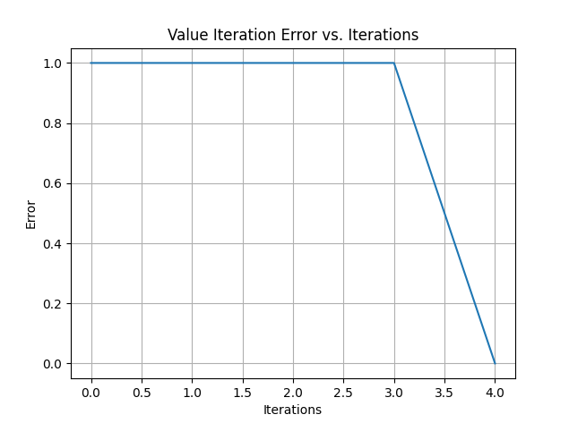

# Report
## Screencapture / Output
```
duong  Assignment7  ➜ ( master)  ♥ 22:09  uv run .\main.py
Python: 3.12.5 (tags/v3.12.5:ff3bc82, Aug  6 2024, 20:45:27) [MSC v.1940 64 bit (AMD64)]
scipy: 1.14.1
numpy: 2.1.3
pandas: 2.2.3
sklearn: 1.5.2
minisom: 2.3.3
matplotlib: 3.9.2
Policy Iteration:
Optimal Policy:
[[2 0 0 0 0]
 [2 0 0 0 3]
 [2 0 0 1 3]
 [2 0 1 1 3]
 [1 1 1 1 2]]
Iterations: 5
```

```
Value Iteration:
Optimal Policy:
[[0 0 0 0 0]
 [2 0 0 0 3]
 [2 0 0 1 3]
 [2 0 1 1 3]
 [1 1 1 1 0]]
Iterations: 5
```


## Questions

### Question 1
For Policy Iteration, the convergence method combines checking the stability of the policy and monitoring the maximum 
change in the value function (delta). The algorithm is considered converged when the policy does not change between 
successive iterations and the maximum change in state values falls below a small threshold of 1e-4. This ensures that 
both the policy and the value function have stabilized. Policy stability indicates that the robot is following a 
consistent strategy across the grid, while the threshold for delta ensures that minor fluctuations in state values are 
minimized, leading to numerical stability. This method was chosen because it efficiently halts iterations once the 
policy becomes stable, ensuring computational efficiency while guaranteeing convergence to an optimal policy.

### Question 2
For Value Iteration, the convergence method is based solely on the maximum change in the value function (delta). The 
algorithm stops when the difference between state values in successive iterations becomes smaller than a threshold of 
1e-4 for all states. This approach is computationally straightforward and ensures that the value function stabilizes 
before terminating the algorithm. The choice of using only the value function’s stability as the criterion is 
appropriate because Value Iteration directly updates state values in each step, and small changes in the value function 
indicate that further updates will not improve the solution significantly. This method is simple, effective, and 
guarantees convergence to the optimal value function while avoiding unnecessary iterations.

### Question 3
Policy Iteration and Value Iteration have distinct convergence characteristics. Policy Iteration typically converges 
faster in terms of the number of iterations because the policy often stabilizes after a few steps. However, each 
iteration involves two phases: policy evaluation and policy improvement. Policy evaluation can require multiple sweeps 
to stabilize the value function, which can increase computational time per iteration. In contrast, Value Iteration 
generally requires more iterations since it directly updates the value function in each step, but each iteration is 
computationally faster as it skips the explicit policy improvement step.

Policy Iteration is particularly useful when the optimal policy is of primary interest, as it provides the policy 
directly at each iteration. It is also more efficient for problems with small to medium-sized grids where the policy 
stabilizes quickly. Additionally, Policy Iteration’s intermediate policies are easier to debug or analyze, making it a 
better choice when interpretability or clarity of the policy is important. On the other hand, Value Iteration is better 
suited for large state spaces where frequent updates to the value function are computationally advantageous.